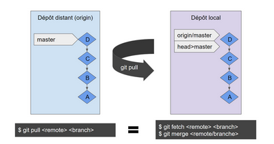
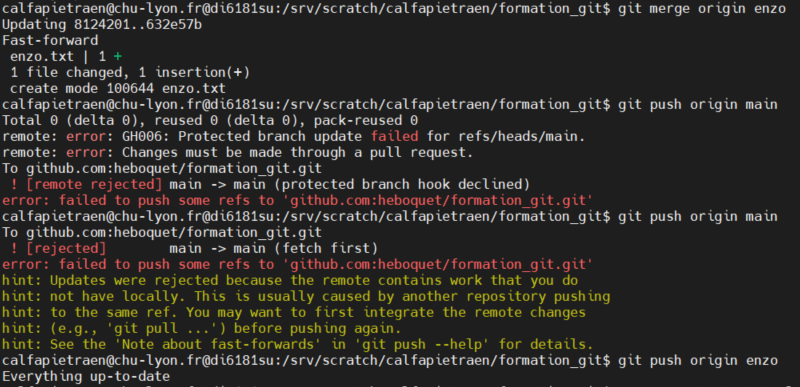
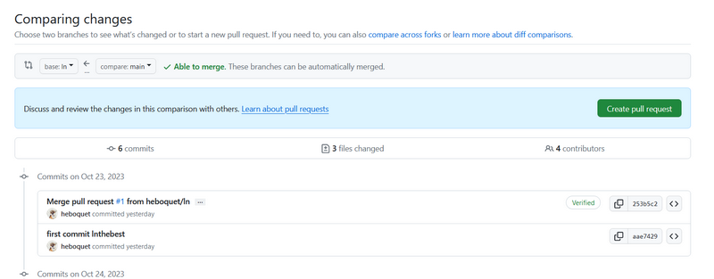

# Formation Git

## Les clefs ssh

### Nouvelle clef
L’utilisation de git nécessite d’associer **chaque machine** utilisée (à savoir : di6182su, di 6181su…) à un compte git. Plusieurs types de clefs existent comme rsa ou ed par exemple, mais aucune contrainte aux HCL est connue : le choix n'a donc pas d'importance.

- Créer la clef sur votre machine :
  - Allez dans le dossier ssh :

  ```text
  cd ~/.ssh
  ssh-keygen -t ed25519 -C <your_email@example.com>
  ```

  - Accepter l’emplacement par défaut de la clef, en appuyant sur **Entrée.** Astuce : possibilité de créer une clé ssh avec nom personnalisé pour en posséder plusieurs. Tapez l’emplacement du fichier par défaut et remplacez *id\_ssh\_keyname* par le nom personnalisé de votre clé
  - Choisissez un mot de passe. Non obligatoire mais **très recommandé**. Vous sera demandé à chaque *push/clone*
  - Copiez le contenu de la clef public `cat id\_ed25519.pub`
- Ajouter la clef ssh à votre compte Github
  - Cliquez sur votre photo en haut à droite de la fenêtre Github pour afficher le menu et cliquez sur « Settings »
  - Choisissez « SSH and GPG keys » et cliquez sur « New SSH key »
  - Donnez un titre à votre clef en rapport avec la machine sur laquelle vous êtes, et collez le contenu de votre clef public dans « Key »

- Tester sur votre machine dans un dossier de votre choix

```text
git clone <git@github.com:heboquet/formation_git.git>
```

Ces étapes sont à faire sur toutes les machines pouvant potentiellement utiliser git sauf la _di3955si_ qui a besoin d’un **Token** et non de clef ssh.

### Le fichier de configuration

Pour éviter la demande répétée du nom d’utilisateur ou de l’adresse email à chaque commit ou seulement personnaliser les paramètres de configuration git, il est nécessaire de connaître le fichier de configuration :  _.gitconfig_. Il n’existe pas si aucune commande en rapport avec lui n’a été exécutée, sinon il se trouve dans le dossier racine. Les principales commandes sont le paramétrage du nom d’utilisateur et de l’adresse mail (par rapport à votre git) :

```text
git config --global user.name heboquet
git config --global user.email <heboquet2@free.fr>
```

Il est possible d’écrire directement dans le fichier _.gitconfig_ mais préférable d’utiliser la commande git config pour éviter tout problème de syntaxe non correcte. La commande `git config --list` permet de lister toutes les configurations listées dans le fichier _.gitconfig_.

## Dépôt git

Un dépôt git peut être créer directement sur Github ou initialiser dans un dossier contenant des fichiers/dossiers en ligne de commande.

### Initialiser un nouveau dépôt en ligne de commande

Les fonctionnalités de git peuvent être ajouter à un dossier contenant déjà des dossiers et des fichiers sans avoir besoin de les copier et les coller dans un repo existant.

- Sur github, créez un repo test
- Sur votre machine, créer un dossier test et y ajouter un fichier toto. Restez dans le dossier et faire les commandes suivantes :

```text
git init
git add toto
git commit -m "first commit"
git branch -M main
git remote add origin <git@github.com:heboquet/test.git>
git push -u origin main
```

La commande `git init` va ajouter le dossier caché _.git_ et donc ajouter les fonctionnalités de git dans le dossier et la commande `git branch -M main` crée une nouvelle branche pour que le premier commit soit affectée à cette branche. Aucune branche n’existe si elle n’est pas créée et une erreur apparaîtra lors du push. La commande `git remote add origin <git@github.com:heboquet/test.git>` permet d’ajouter le contenu du dossier à un repo distant (ici Github). L’adresse du repo est son adresse ssh.


### Cloner un dépôt déjà existant

Pour des besoins divers, il est aussi possible de cloner un dépôt déjà existant. Pour pouvoir cloner un dépôt avec un protocole SSH il est essentiel d’avoir une clef ssh associé à un compte Github (voir la première sous-partie de la première partie). Sinon, il est aussi possible de cloner un dépôt avec le protocole HTTP(S). Il demande cependant de donner ses identifiants pour certaines requêtes alors que le protocole SSH n’a pas ce souci comme il utilise des clefs publiques et privés.

|**SSH**|**HTTP(S)**|
| :-: | :-: |
|Utilise les clefs publiques et privés|Utilise l’identifiant et mot de passe|
|Port 22|Ports 80 et 443 (rarement bloqués)|

Pour cloner un dépôt, lancez une de ces commandes dans un dossier :

- (en ssh) `git clone <git@github.com:heboquet/formation_git.git>`
- (en https) `git clone <https://github.com/heboquet/formation_git.git>`

Ces liens sont disponibles en cliquant sur le bouton vert "Code".

## Bonne utilisation des commandes git

### Les branches
Les branches permettent de travailler sur une fonctionnalité particulière sans perturber le flux principal (<https://grafikart.fr/tutoriels/branch-merge-587>). Elle sont souvent utilisées pour travailler sur la mise en place de nouvelles fonctionnalités mais sont aussi utilisées pour permettre une bonne organisation dans le projet, avec des branches qui pointent sur une utilisation particulière. La commande qui permet de gérer les branches est git branch.

**Information importante** : la création d’une branche se fait dans la plupart du temps sur la branche _main_. Créer une branche est une copie de celle où pointe HEAD.

Pour créer une branche, placez-vous dans votre dépôt git et lancez :

```text
git branch lenomdemabranche
```

Pour visualiser toutes les branches et savoir sur quelle branche vous êtes (marqué par un astérisque), lancez simplement :

```text
git branch```


Lors de la création d’une branche, git ne se place pas automatiquement dessus. Il conserve un pointeur spécial appelé HEAD permettant de pointer sur la branche locale où nous nous trouvons. Dans le cas de création de branche, ce pointeur ne change pas de branche mais reste à la dernière qu’il pointait.
Pour pouvoir pointer la nouvelle branche, lancez cette commande :

```text
git checkout ln
```


Il peut arriver de vouloir modifier le nom de sa branche pour x ou y raison. Il suffit simplement d’utiliser l’option -m.

```text
git branch -m lenouveaunomdemabranche
```


Pour supprimer une branche, vous pouvez utilisez cette commande seulement si vous avez fusionnez les informations de la branche. Vous pouvez toujours forcer cette suppression en utilisant l’option -D. La suppression se fait à partir d’une autre branche.

```text
git branch -d lenouveaunomdemabranche
```

Pour retrouver votre branche crée sur Github, créer un fichier test et commité sur cette branche.

```text
touch tata
git add tata
git commit -m "first commit"
git push origin votrebranche
```

**Les autorisations**

Github permet de donner des autorisations particulières sur les branches. Par défaut, aucune autorisation n’est donnée mais il est très recommandé d’au moins protéger la branche main. Pour cela, sur le dépôt Github, cliquez sur Settings, puis sur le menu à gauche, cliquez sur « Branches ».  Vous retrouverez ici toutes les règles de protection de vos branches et de quoi les modifier ou en ajouter.


Plusieurs règles existent et sont toutes particulières. Ici, nous protégerons la branche main en utilisant un pull request. Cela permet d’indiquer aux autres utilisateurs les modifications que vous désirez envoyer sur la branche main. Tous les collaborateurs du projet peuvent discuter et examiner les modifications potentielles et ajouter des validations de suivi. Lorsque le pull request est validé, une personne avec autorisation d’écriture peut alors approuver la révision et donc ajouter les modifications demandées à la branche main.

### Modification de fichier à l’index

Il existe plusieurs commandes mettant à jour l’index. Ce dernier contient un instantané du contenu de la copie de travail et sera utilisé comme contenu du prochain commit. Parmi les commandes, la plus utilisée est la commande `git add`. Elle vient ajouter le contenu actuel trouvé dans l’arbre de travail pour préparer le contenu de la prochaine validation. Cette commande s’utilise après avoir réalisé des modifications du projet pour ajouter tout fichier nouveau ou modifié à l’index et peut être utilisé autant de fois que nécessaire. Il est – très grandement – préférable de ne pas utiliser cette commande en prenant compte *tous* les fichiers modifiés et créés. Il faut ajouter les fichiers et/ou dossiers un par un dans la commande :

```text
git add cefichier etpuisceluila etunautre
```

La vérification de cette commande peut être effectuée avec la commande. Un résumé des fichiers modifiés préparés pour la prochaine validation sera listé :

```text
git status```

Astuce : pour ne pas ajouter de fichiers spécifiques, vous pouvez utiliser le fichier gitignore et lister des fichiers et/ou des dossiers qui ne seront pas ajouté au futur commit.
La commande de suppression d’un fichier ou d’un dossier dans git est aussi souvent utilisée. Elle permet de ne plus suivre ce fichier et/ou dossier dans le git.

```text
git rm cefichier```

### Les commits

Faire un commit permet d’enregistrer le contenu actuel de l’index avec un message de validation décrivant la modification. Le nouveau commit est un fils direct de HEAD, habituellement au sommet de la branche actuelle et la branche est mise à jour pour pointer dessus.
La première étape pour pouvoir faire un commit et d’ajouter des fichiers prêts au commit avec un`git add`ou en utilisant l’option -a, qui va ajouter tous les fichiers connus listés dans l’index. Une commande de commit s’effectue donc comme suit :

```text
git commit -m "first commit"
```

L’option -m permet de laisser le message de description du commit, sinon une fenêtre Nano (ou votre éditeur préféré) s’ouvre pour que vous puissiez écrire votre description. Il est plus utile de donner une vraie description de vos changements dans le projet plutôt qu’un « update ».
Il est conseillé de ne faire que 4 commits maximum par jour, afin d’éviter le surplus de commit inutile (une faute d’orthographe peut être ajouté au prochain commit plus complet, par exemple). Aussi, si le message de description du commit a mal été renseigné, une option de la commande permettant de gérer ces petites erreurs crée un commit qui remplace l’ancien. N’oubliez pas de 
```text
git add votrefichierunpetitpeumodifie``` pour l’ajouter au nouveau commit qui remplacera l’ancien.

```text
git commit --amend```

Une nouvelle fenêtre sur votre éditeur préféré s’ouvre et le message de l’ancien commit s’affiche et peut être modifié. Vous pouvez vérifier que votre message de commit en faisant la commande :

```text
git log```

Tous les commits sont listés avec leur message, l’auteur, la date et la branche.

**Il est préférable de se rendre compte de son erreur avant de push** : bien que la modification du commit soit aussi possible, le fait de modifier change l’historique du dépôt et les personnes qui ont déjà cloné le dépôt doivent corriger manuellement l’historique local. Il faudra alors réaliser ces commandes :

```text
git commit --amend
git push --force-with-lease origin nombranche
```

S’il n’est pas nécessaire de changer le message de commit, la commande suivante permet seulement de modifier le fichier.
```text
git commit --amend --no-edit
```

Dans tous les cas de commit, le numéro change mais l’heure ne se modifie pas. La commande git log n’affiche pas les commit écrasé par le dernier modifié mais la commande git reflog les fait. Elle affiche également les petits noms de commit et si ces derniers sont modifiés ou pas (mentionné amend ou non). Dans les deux cas, la position du HEAD est mentionnée. Seulement la dernière modification du commit est visible sur Github (aucune information au sujet des amend).

### Partage et mise à jour du projet

**Fetch et pull**

Dans des projets communs, une bonne utilisation de git est très importante pour avoir un bon environnement de travail. Dans un premier temps, après avoir fait un commit sur la branche adéquate au projet, il faut récupérer le travail potentiellement envoyé par des collègues. Pour cela, il existe deux commandes importantes git à connaître.
La première chose à faire est de récupérer les modifications présentes sur le serveur distant que vous n’avez pas encore sur votre copie en local. Pour cela, on utilise la commande git fetch qui va alors mettre à jours dans le dépôt local, l’ensemble des références distantes (branches, tag…) et récupérer les commits associés. Cependant, cette commande ne va pas appliquer, dans notre espace de travail, les modifications récupérées. Nous resterons sur notre commit courant. La commande `git fetch` fait seulement évoluer les références d’origin.( <https://codeur-pro.fr/difference-entre-git-fetch-et-git-pull/>). La deuxième étape est alors d’appliquer les modifications sur votre espace de travail en ramenant le master local sur le même commit que le master distant ; la commande `git merge` est faite pour cela.

Exemple :





Dans votre espace de travail, il faudra donc effectuer ces deux commandes :

```text
git fetch origin nombranche
git merge origin nombranche```

Pour information, ces deux commandes sont l’équivalent de `git pull`. Elle vient effectuer ces deux dernières actions à la suite.
Si vous êtes sur un dépôt contenant plusieurs personnes susceptibles de travailler sur le même projet en même temps, il est préférable d’utiliser le fetch alors que si vous êtes seul sur un dépôt, le pull est plus conseillé.
Une fois toutes les modifications récupérées, le travail effectué peut alors être envoyer du dépôt local vers le dépôt central. Il peut être fait dans n’importe quel dossier de travail du git et un ou plusieurs commit doivent être précédemment fait. Il est fortement conseillé d’effectuer cette commande seulement **une fois par jour** et d’informer les collègues travaillant sur le même projet (afin qu’ils puissent récupérer vos modifications).

```text
git push origin nombranche```

Le nom de la branche doit toujours être spécifiée pour ne pas faire d’erreur.

**Merge**

Lorsque le travail est envoyé et partagé sur la branche de votre projet (commit + push), la suite logique est d’ajouter ces modifications sur la branche principale. Comme vu dans la partie « Les autorisations », la branch main est protégée et donc une autorisation est nécessaire pour confirmer la demande de merge.
Après avoir récupérer toutes les mises à jour sur la branche main (`git pull`), assurez-vous être sur la branche qui va accueillir les changements.

```text
git status
git merge origin nombranche
```

Jusqu’à cette étape, tout se passe sans erreur puisque le merge s’effectue en local. C’est en voulant transférer les changements locaux au serveur distant qu’une erreur va apparaître.



La branche main est bien désignée comme protégée et les changements peuvent se faire exclusivement en faisant un`pull request`. Il n’est donc pas possible de réaliser de merge et de push sans autorisation sur la branche main, après avoir mis à jour sa propre branche. Cependant, il est possible de faire une demande : c’est ce qu’on appelle un Pull request.

- Sur Github, placez-vous sur votre branche. Un message vous prévient que vous avez un ou plusieurs commits de retard par rapport à la branche main.
- Cliquez sur le lien des commits en retard.
- Cliquez sur « Create pull request »

- Vérifiez si le merge va bien de votre branche à la branch main.

- Complétez avec un titre adéquate aux changements faits sur votre branche et expliquez ce que vous avez changé.
- Cliquez sur « Create pull request »
- Tous les pull request sont organisé en sujet que tous les collaborateurs peuvent avoir accès en lecture et en écriture. Chacun peut vérifier les nouveaux changements qui seront basculés sur main et une seule personne est nécessaire pour valider le pull request. Des informations sur les conflits sont également affichés.
- Au besoin, l’utilisateur voulant vérifier et valider le pull request doit aller sur « Files changed » pour approuver ou non les fichiers modifiés.

- Si ce n’est pas vous l’auteur du pull request, vous pouvez approuver les changements et mettre un commentaire.
- Il sera possible par la suite de « Merge pull request ». Sans les fichiers approuvés, le pull request ne pourra pas être merge sur la branche main.

Le sujet du pull request se ferme automatiquement et la branche main est bien à jour.

**Les commandes astuces**

**Git blame** : Montre le numéro du commit d’un fichier spécifié, des modifications, l’auteur et la date de ces dernières. Exemple :

```text
git blame README.md
```

**Git checkout** : En plus de permettre de changer de branche, cette commande peut se déplacer sur les commits. Il suffit de lancer cette commande : 
```text
git checkout <commit>
```
Aucun dossier des commits les plus récents ne seront supprimés, ni modifiés. Elle peut être utile dans le cas où il y aurait besoin de lancer une analyse avec un pipeline d’une différente version de commit.
La commande suivante permet de revenir sur la branche principale, sur la version du dernier commit.

```text
git checkout main
```

**Git reset**

**git revert**


